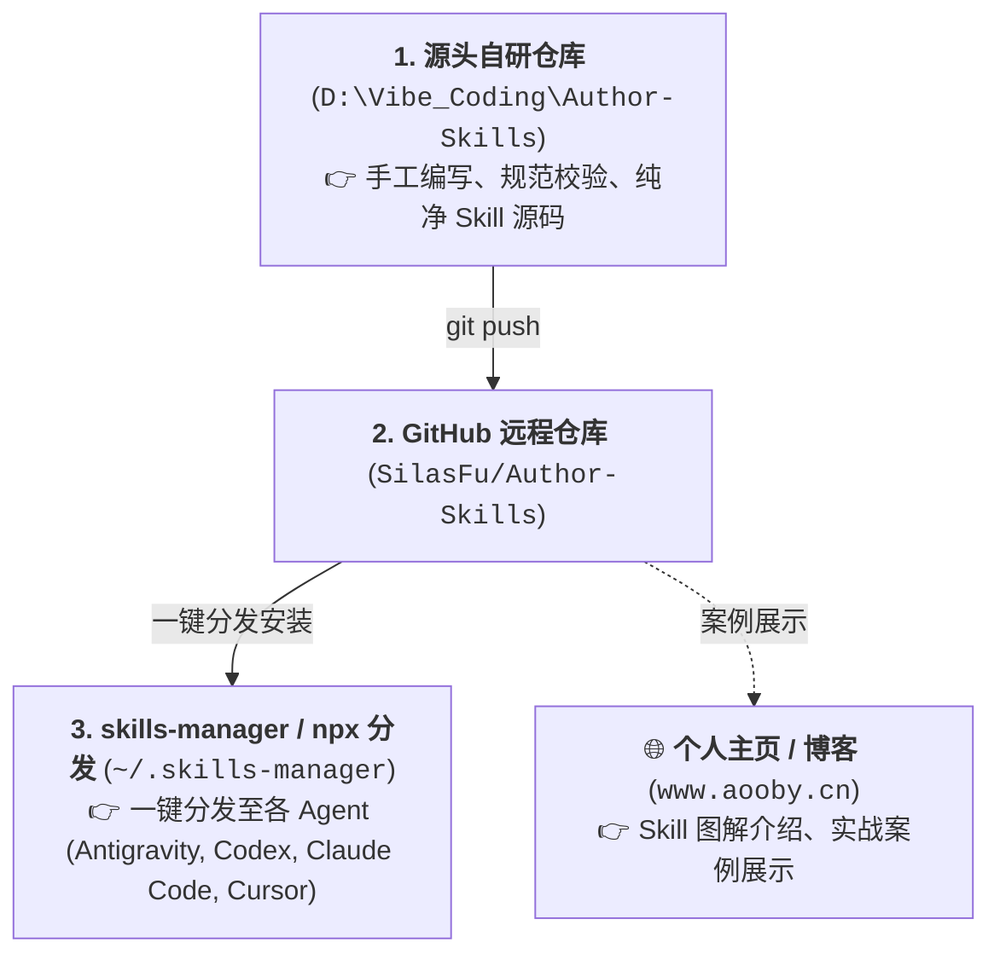

# Author-Skills (自研 Agent 技能母体仓库)

个人原创与深度定制的 AI Agent 技能（Skills）源头仓库。所有技能遵循 [writing-for-agents](https://github.com/SilasFu/Author-Skills) 规范编写，专注于工作区生态的**机制建立、自我修正与规则自进化**（元治理母体引擎），支持通过 `skills-manager` 或 `npx` 一键安装分发至 Antigravity、Codex、Claude Code、Cursor 等多 Agent 环境。

> 🌐 **图解与实战**：每个 Skill 的设计理念、原理图解与实战案例，参见个人主站：[https://www.aooby.cn/](https://www.aooby.cn/)

---

## 🏛️ 仓库定位与流通链路

---

## 📦 技能清单 (Skill Inventory)

| 技能名称 | 核心职责 | 适用场景与触发方式 | 详细图解 |
| :--- | :--- | :--- | :--- |
| **workspace-bootstrap** | **全生态冷启动自举** | 全生态冷启动与跨设备一键拉通。自举 6 大工作区骨架、自动注入各 Bank 专属 `AGENTS.md` 与 `CLAUDE.md` 规则桥接契约、消除盘符硬编码、多 Agent 规则自动挂载。 | [图解与实战 ↗](https://www.aooby.cn/) |
| **project-guard** | **项目守护与规则进化** | 项目生命周期守护。三大 SOP：(1) 新项目 `init` 植入规范（`AGENTS.md` + `DESIGN.md` + `CLAUDE.md`）；(2) 架构腐烂/写丑时 `doctor` 自动重构与自愈；(3) 用户纠偏时 `evolve` 自动进化规则。 | [图解与实战 ↗](https://www.aooby.cn/) |
| **workspace-lifecycle-governance** | **跨工作区流转决策** | 跨工作区生命周期路由与决策引擎。灵感总控中枢（Idea Hub）跨区自动派发闭环、知识缺口自感知登记、新项目 vs 存量扩展阶梯决策、权威记忆同步。 | [图解与实战 ↗](https://www.aooby.cn/) |
| **my-memories** | **权威记忆查询接口** | 权威稳定知识库（`MY_Memories`）的画像、工作偏好、协作边界、架构规范查询接口。 | [图解与实战 ↗](https://www.aooby.cn/) |

---

## 📐 技能编写标准与工程化架构

所有自研技能严格遵循工业级复合架构与编写标准：
1. **复合工程化架构 (Composite Architecture)**：全系采用 `SKILL.md` (轻量控制中枢) + `scripts/` (确定性 Python 脚本) + `templates/` (金标契约模板) + `references/` (渐进披露手册) 架构，杜绝 AI 现场数行数、查漂移时的推理随机性；
2. **Frontmatter 严谨**：`description` 前置 Leading Words，明确正交分支，杜绝隐私泄漏；
3. **完成标准明确 (Completion Criteria)**：每个 SOP 结尾必须有可客观检验的完成度（Checkable Bounds），防止早退；
4. **正面引导 (Positive Prompting)**：使用目标肯定行为定义，减少单纯否定句式；
5. **编码与跨平台防御**：所有文件统一使用 UTF-8 without BOM，CLI 脚本内置 Windows 控制台弹性编码防御。

---

## 📄 开源许可证与使用协议 (License)

本项目采用 **[CC BY-NC-SA 4.0 (知识共享-署名-非商业性使用-相同方式共享 4.0 国际协议)](LICENSE)** 开源授权。
