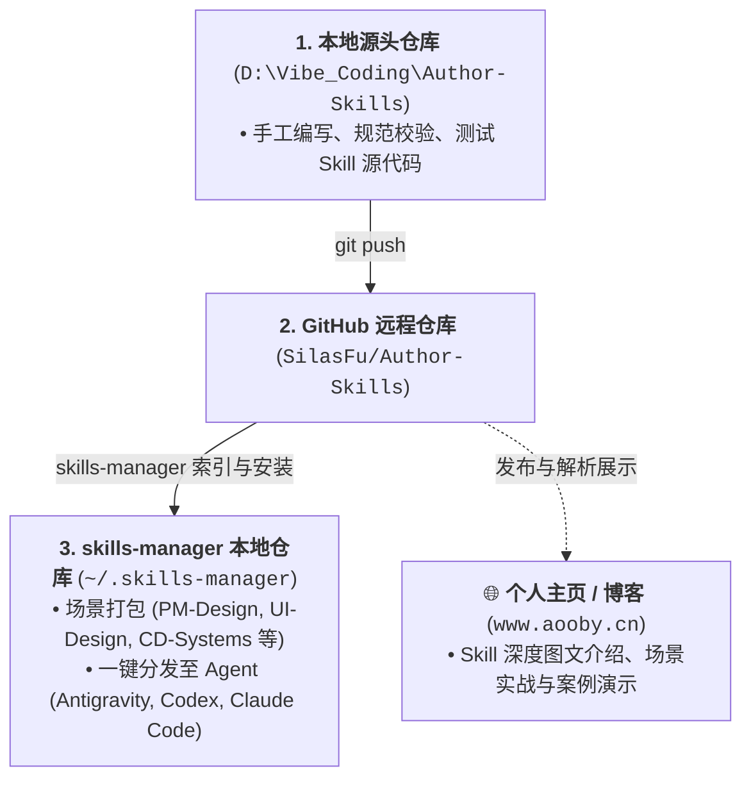

# Author-Skills (自研 Agent 技能库)

个人原创与深度定制的 AI Agent 技能（Skills）源头仓库。所有技能遵循 [writing-for-agents](https://github.com/SilasFu/Author-Skills) 规范编写，支持通过 skills-manager 一键安装分发至 Antigravity、Codex、Claude Code 等多 Agent 运行环境。

> 🌐 **技能深度介绍与图文实战**：每个 Skill 的完整设计理念、原理拆解与实战案例，请移步个人网站查看：[https://www.aooby.cn/](https://www.aooby.cn/)

---

## 🏛️ 仓库定位与流通链路

---

## 📦 技能清单 (Skill Inventory)

| 技能名称 | 核心职责 | 适用场景与触发方式 | 详细介绍 |
| :--- | :--- | :--- | :--- |
| **project-guard** | **项目生命周期护航与诊断修复** | **主动触发**：(1) 新项目初始化 init 注入规范；(2) 遇到代码混乱/界面写丑时 doctor 自动体检重构；(3) 遇到问题时 evolve 自动沉淀新规永久免疫。 | [图文解析 ↗](https://www.aooby.cn/) |
| **workspace-lifecycle-governance** | **多工作区生命周期治理** | 多工作区拓扑路由、知识缺口感知登记、新建项目 vs 现有项目扩展 4 门禁判定与连续性同步。 | [图文解析 ↗](https://www.aooby.cn/) |
| **my-memories** | **权威记忆库查询接口** | 权威稳定知识库（D:\MY_Memories）的画像、工作偏好、协作边界、产品架构与治理规范查询接口。 | [图文解析 ↗](https://www.aooby.cn/) |

---

## 📐 技能编写与入库标准

编写或更新本库技能必须严格遵循以下标准：
1. **Frontmatter 严谨**：description 前置 Leading Words，清晰列出触发分支，杜绝正文泄漏。
2. **界限明确 (Completion Criteria)**：每个 SOP 必须具备可检验的完成度（Checkable Bounds），防止模糊交工。
3. **正向引导 (Anti-Negation)**：优先使用目标正向表述，避免单纯否定句式。
4. **编码规范**：所有文件统一使用 UTF-8 without BOM。

---

## 📄 开源许可证与使用协议 (License)

本项目采用 **[CC BY-NC-SA 4.0 (知识共享署名-非商业性使用-相同方式共享 4.0 国际许可协议)](LICENSE)** 开源授权。

- ✅ **个人与学习免费**：允许自由阅读、研究、修改并用于个人日常开发与非营利性场景。
- ❌ **严禁商业用途**：未经作者书面授权，**严禁**将本库内的任何 Skill 源代码、设计规范用于商业牟利（包括但不限于付费打包售卖、嵌入商业付费 SaaS/产品、作为付费培训课程物料等）。
- 🔄 **保持相同方式共享**：任何基于本项目进行的二次分发或演绎，均必须保留原作者署名（SilasFu/Author-Skills）并以相同协议开源。