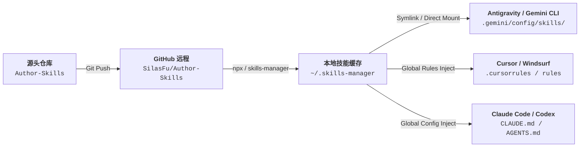

# Author-Skills 技术架构与流通拓扑 (ARCHITECTURE)

## 1. 架构拓扑与五大工作区协同

`Author-Skills` 作为中枢母体，与其余四大工作区形成如下拓扑闭环：

```text
┌─────────────────────────────────────────────────────────────────────────────┐
│                             五大工作区生态拓扑                              │
├─────────────────────────────────────────────────────────────────────────────┤
│ 1. Memory Bank (记忆大脑)      ── D:\MY_Memories (权威知识、决策偏好、治理规则) │
│ 2. Project Bank (自建代码)     ── D:\Vibe_Coding (生产项目、AGENTS.md 契约)     │
│ 3. Learning Bank (知识学习)    ── D:\My_Learning (技术研究、缺口登记与实验)   │
│ 4. Reference Bank (只读参考)   ── D:\Reference_Coding (第三方开源只读学习)     │
│ 5. Author-Skills (自研技能母体)── D:\Vibe_Coding\Author-Skills (元治理技能源头)│
└─────────────────────────────────────────────────────────────────────────────┘
```

---

## 2. 通用自举与实例解耦机制

```text
┌───────────────────────────────────────┐
│ 1. 通用开源框架 (Framework Engine)   │ ── 100% 中立、无私密数据、纯净 SOP 逻辑
└──────────────────┬────────────────────┘
                   │ /workspace-bootstrap init
                   ▼
┌───────────────────────────────────────┐
│ 2. 动态用户实例 (User Private Instance)│ ── 引导输入私有 Git URL / 本地目录
└──────────────────┬────────────────────┘
                   │
                   ▼
┌───────────────────────────────────────┐
│ 3. 环境变量锚点注入                   │ ── $env:AI_WORKSPACE_ROOT & MY_MEMORIES_PATH
└───────────────────────────────────────┘
```

---

## 3. 技能分发与多 Agent 流通链路



---

## 4. 三层信息渐进披露架构 (Progressive Disclosure)

每个技能严格遵循 Agent 三层加载机制：
1. **Metadata 头部层**（`name` + `description`）：常驻 Agent 上下文（~100 词），作为触发指针；
2. **SKILL.md 主体层**：触发后加载入上下文（控制在 500 行以内），提供核心 SOP 与完成标准；
3. **Bundled Resources 扩展层**：存放于 `references/`、`scripts/`，按需由 Agent 自主读取或执行。
