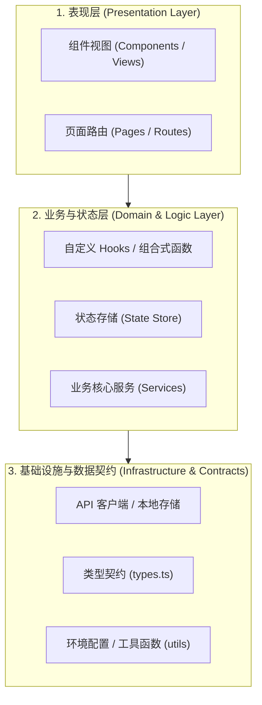
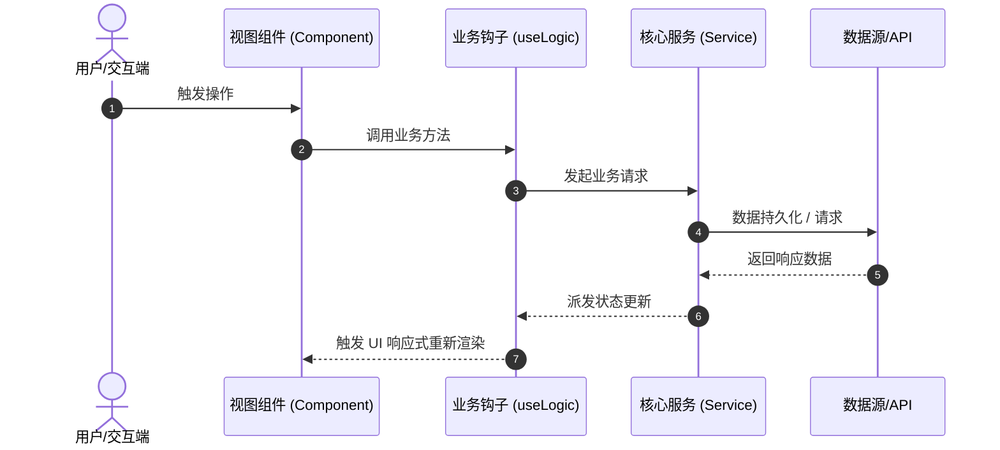

# {{PROJECT_NAME}} 技术架构与模块设计文档 (ARCHITECTURE)

## 1. 系统总体分层架构 (System Architecture)

本项目采用清晰的三层职责切片架构：

---

## 2. 核心模块职责与边界清单

| 模块目录 | 核心职责 | 依赖项 | 禁忌行为 (Don'ts) |
| :--- | :--- | :--- | :--- |
| `src/components/` | 纯 UI 渲染与视图交互 | `types.ts`, `DESIGN.md` | 严禁编写复杂异步请求与副作用逻辑（业务单文件 ≤ 200 行） |
| `src/hooks/` / `src/services/` | 业务逻辑、状态衍生与 API 调度 | `types.ts`, `api` | 严禁包含 JSX/HTML 渲染代码 |
| `src/types/` | 数据结构与 TypeScript 类型契约 | 无（底层事实源） | 严禁使用 `any` 类型逃逸 |

---

## 3. 关键数据流向 (Data Flow)

---

## 4. 关键技术选型与运行时依赖

- **语言与运行时**：{{TECH_STACK}}
- **构建与测试工具**：{{BUILD_TOOL}}
- **设计契约**：遵循项目根目录 [`DESIGN.md`](../DESIGN.md)
- **代码质量与门禁**：遵循项目根目录 [`AGENTS.md`](../AGENTS.md)
