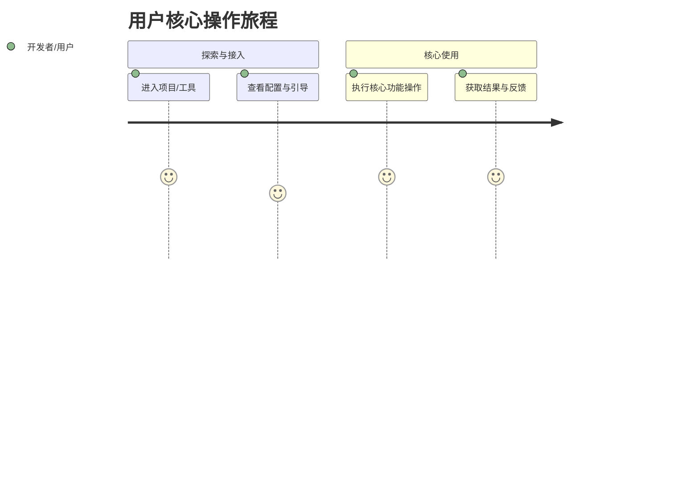

# {{PROJECT_NAME}} 产品需求与业务规格文档 (PRD)

## 1. 项目诞生背景与痛点

### 1.1 为什么发起本项目？（诞生背景）
- **核心痛点**：{{PROJECT_PAIN_POINTS}}
- **目标用户**：{{TARGET_USERS}}
- **核心定位**：{{PROJECT_DESCRIPTION}}

---

## 2. 用户核心用例与交互旅程

---

## 3. 功能规格矩阵 (Feature Specifications)

| 模块名称 | 功能点 (Feature) | 详细规格与交互说明 | 优先级 | 验收标准 (Checkable Criteria) |
| :--- | :--- | :--- | :--- | :--- |
| **核心模块 1** | {{FEATURE_1_NAME}} | {{FEATURE_1_DESC}} | P0 | {{FEATURE_1_CRITERIA}} |
| **核心模块 2** | {{FEATURE_2_NAME}} | {{FEATURE_2_DESC}} | P0 | {{FEATURE_2_CRITERIA}} |
| **扩展能力**   | {{FEATURE_3_NAME}} | {{FEATURE_3_DESC}} | P1 | {{FEATURE_3_CRITERIA}} |

---

## 4. 明确非目标 (Non-Goals & Boundaries)

为防止项目范围蔓延 (Scope Creep)，以下内容**明确不在**当前版本交付范围内：
1. ❌ **Non-Goal 1**：{{NON_GOAL_1}}
2. ❌ **Non-Goal 2**：{{NON_GOAL_2}}
3. ❌ **Non-Goal 3**：{{NON_GOAL_3}}

---

## 5. 质量与交付完成标准 (Completion Gates)

1. **功能完整性**：P0 核心用例 100% 跑通；
2. **代码门禁**：通过 `AGENTS.md` 规定的编译器检查与单文件 ≤ 200 行硬限制；
3. **设计一致性**：严格遵守 `DESIGN.md` 设计规范与 8 大状态覆盖。
