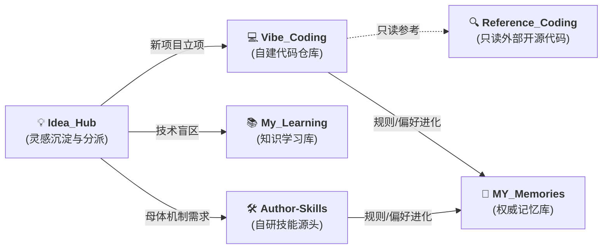

# 工作区 6 大 Bank 拓扑规约与数据流向手册 (Topology Specification)

为实现极简、高内聚、跨设备零硬编码的工程生态，本地文件系统划分为严格物理隔离的 6 大工作区（Banks）。

---

## 1. 六大工作区角色与权责边界

| 工作区角色 | 相对目录 | Git 仓库属性 | 读写权限 | 核心职责与数据边界 |
| :--- | :--- | :--- | :--- | :--- |
| **💡 灵感总控中枢 (Idea Hub)** | `Idea_Hub` | 私有仓库 | 读写 (Triage) | 统一接收碎片需求，评估并派发至其他工作区，派发后归档。 |
| **🧠 权威记忆库 (Memory Bank)** | `MY_Memories` | 私有权威仓库 | 读写受控 (SSOT) | 沉淀个人画像、决策偏好、协作边界与项目架构设计。 |
| **💻 自建代码库 (Project Bank)** | `Vibe_Coding` | 包含多个独立 Repo | 读写 (开发) | 存放用户的所有自建生产项目（禁止混入未修改的外部开源库）。 |
| **📚 知识学习库 (Learning Bank)** | `My_Learning` | 私有/开源仓库 | 读写 (学习) | 存放技术盲区登记、研究计划与系统知识沉淀。 |
| **🔍 外部参考库 (Reference Bank)** | `Reference_Coding` | 外部 Git 克隆 | **严格只读 (Readonly)** | 存放第三方开源项目源码供只读学习，严禁在此进行自研业务开发。 |
| **🛠️ 自研技能库 (Author Skills)** | `Author-Skills` | 开源/私有母体库 | 读写 (母体) | 自研 Agent 技能源头仓库（元治理母体），严禁混入业务代码。 |

---

## 2. 跨工作区数据流向规范 (Cross-Bank Data Flow)

---

## 3. 环境变量消除硬编码标准

所有技能与脚本在寻址时，必须优先读取以下环境变量，禁止硬编码盘符（如 `D:\` 或 `C:\`）：
- `AI_WORKSPACE_ROOT`：工作区根目录（如 `D:\` 或 `/Users/name/Workspaces`）；
- `MY_MEMORIES_PATH`：权威记忆库路径（如 `$AI_WORKSPACE_ROOT/MY_Memories`）。

---

## 4. 工作区专属规则契约 (Bank-Level Rule Contracts)

在全生态冷启动自举时，每个工作区根目录均自动注入专属的 `AGENTS.md` 与 `CLAUDE.md` 规则桥接契约：
- **`Idea_Hub/AGENTS.md`**：限定 3 级流转与派发归档，禁止写业务代码；
- **`MY_Memories/AGENTS.md`**：限定画像、偏好、协作边界与项目索引的 SSOT 维护，受控写入；
- **`Vibe_Coding/AGENTS.md`**：限定自建生产项目存放根目录，必须由 `project-guard` 独立守护；
- **`My_Learning/AGENTS.md`**：限定技术盲区登记与深度研究笔记，非生产代码库；
- **`Reference_Coding/AGENTS.md`**：**严格只读**，严禁在此修改源码或进行自研业务开发；
- **`Author-Skills/AGENTS.md`**：自研 Agent 技能母体源头，元治理原则。

